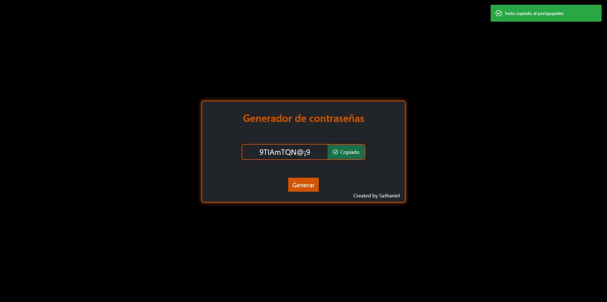
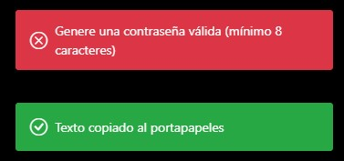

# PassGen - Generador de Contraseñas Seguras

PassGen es una aplicación web simple pero poderosa para generar contraseñas seguras aleatorias con un solo clic. Perfecta para crear credenciales robustas para tus cuentas.

## Características

- Genera contraseñas de 8 a 15 caracteres de longitud aleatoria
- Incluye múltiples tipos de caracteres: números, letras (mayúsculas y minúsculas), símbolos especiales
- Función de copiar al portapapeles con confirmación visual
- Interfaz minimalista y responsive
- Notificaciones toast para feedback de usuario
- Diseño personalizado con tema naranja oscuro

## Tecnologías Utilizadas

- HTML5
- CSS3 (con variables personalizadas)
- JavaScript
- Bootstrap 5.3
- Bootstrap Icons

## Cómo Usar

1. Haz clic en el botón "Generar" para crear una nueva contraseña
2. La contraseña aparecerá en el campo central
3. Haz clic en "Copiar" para copiarla al portapapeles
4. ¡Listo! Puedes pegarla donde la necesites

## Interfaz




## Requisitos

Navegador web moderno (Chrome, Firefox, Edge, Safari)

## Instalación

```bash
git clone https://github.com/tu-usuario/passgen.git
cd passgen